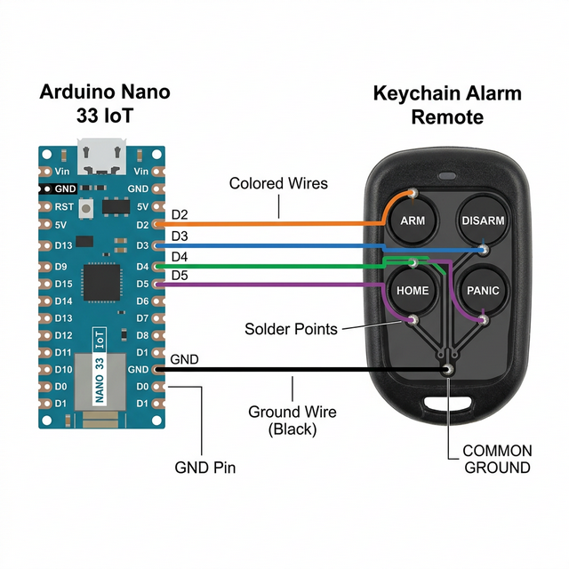

# Alexa Alarm Virtual Remote

An Arduino-based IoT solution to "Alexify" your Home Alarm security system using Arduino IoT Cloud. It emulates a physical remote control by activating relays or digital inputs on your existing alarm panel.

## Features (Version 2.1)
- **Cloud Synchronization Protection**: Wait for 20s after connecting before accepting any cloud commands to ensure stable state.
- **Momentary Switch Emulation**: Activates the signal for exactly 1,000ms (1 second) and then releases it automatically.
- **Action Cooldown**: Prevents rapid re-triggering with a 3-second delay between actions.
- **Smart Feedback**: Uses the built-in LED to indicate if the device is connected (LOW) or searching for a connection (BLINKING).
- **Multiple Channels**: Controls Arm, Home, Disarm, and Panic functions.

## Pinout Configuration
| Function | Arduino Pin | Description |
| :------- | :---------- | :---------- |
| **ARM**    | 2           | Activates the Alarm Arming function |
| **HOME**   | 3           | Activates the Home/Partial Arming function |
| **PANIC**  | 4           | Triggers the Panic/SOS signal |
| **DISARM** | 5           | Deactivates the Alarm system |
| **STATUS** | LED_BUILTIN | Blinks when disconnected from the cloud |

### Connection Diagram

## Hardware Requirements

- Arduino Nano 33 IoT (or compatible SAMD board)
- Jumpwires to connect the board to the alarm remote
- 5V Power Supply

## Cloud Setup
This project uses **Arduino IoT Cloud**. You need to create a "Thing" with the following properties:
- `arm` (CloudSwitch, Read/Write, On Change)
- `disarm` (CloudSwitch, Read/Write, On Change)
- `home` (CloudSwitch, Read/Write, On Change)
- `panic` (CloudSwitch, Read/Write, On Change)

Ensure you update `arduino_secrets.h` with your Wi-Fi credentials and Cloud certificates.

## License
Public Domain. Author: txominn (df.antonacci@gmail.com)